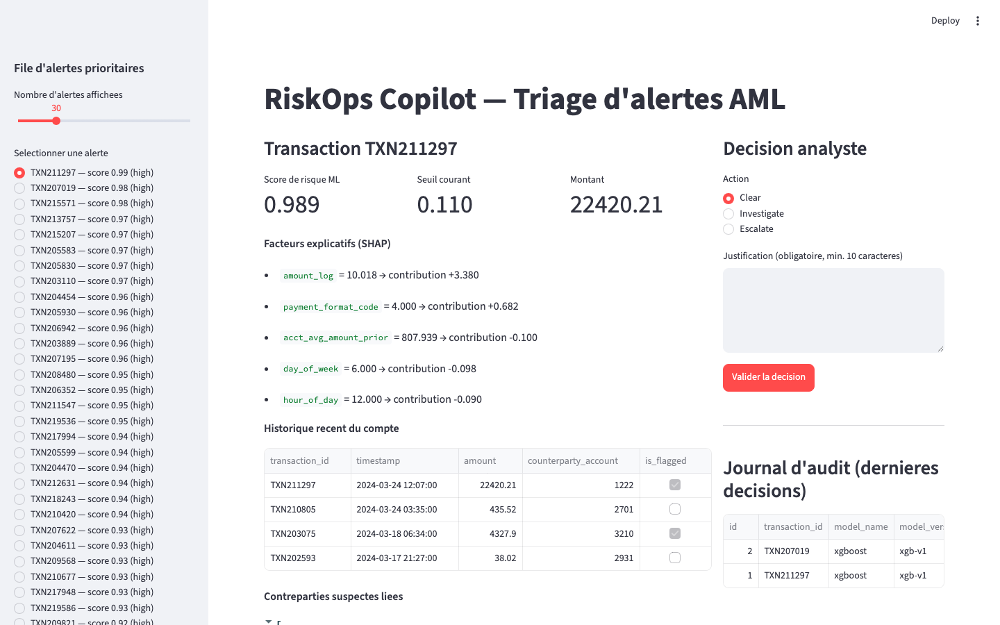
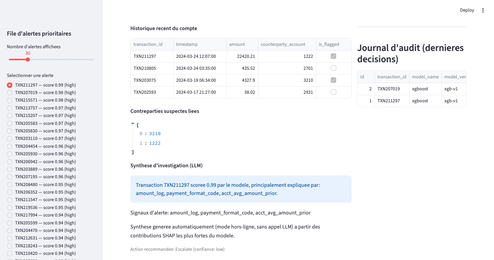
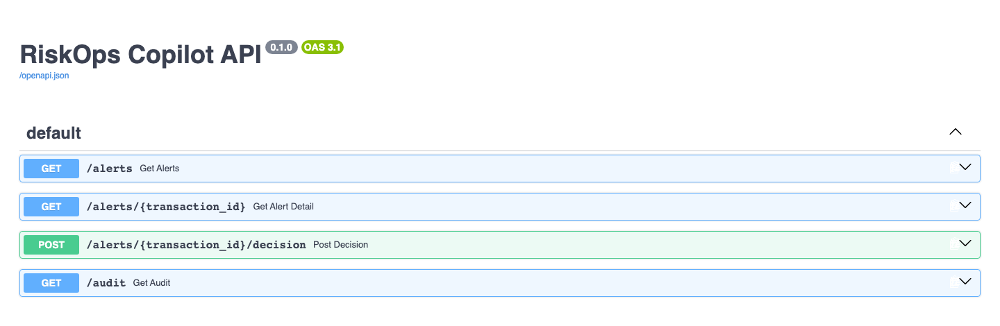

# RiskOps Copilot — Explainable AML Alert Triage

Système de priorisation d'alertes anti-blanchiment (AML) explicable et contrôlé :
score ML, facteurs SHAP, historique de compte, synthèse LLM structurée, décision
analyste avec justification obligatoire, journal d'audit versionné.

## Stack

Python · pandas · scikit-learn · XGBoost · SHAP · FastAPI · Pydantic · Streamlit ·
SQLite · Claude (synthèse LLM) · Docker · pytest · GitHub Actions.

Ce README couvre l'usage (quickstart, tests, résultats). Pour le raisonnement
derrière chaque choix — enjeux métier, arbitrages techniques, alternatives
écartées et pourquoi — voir [docs/CONCEPTION.md](docs/CONCEPTION.md).

## Démonstration

UI analyste (Streamlit) : file d'alertes triée par score, score ML et seuil
courant, facteurs explicatifs SHAP transaction par transaction, historique du
compte, décision avec justification obligatoire et journal d'audit des
décisions déjà prises.



Synthèse LLM structurée (résumé, signaux d'alerte, action recommandée) sous
les facteurs SHAP, et journal d'audit des décisions passées :



Documentation interactive de l'API FastAPI (`/docs`) : file d'alertes, détail
explicable, enregistrement de décision, consultation de l'audit :



## Données

Le [dataset IBM AML](https://www.kaggle.com/datasets/ealtman2019/ibm-transactions-for-anti-money-laundering-aml)
(transactions synthétiques : virements, achats carte, chèques, avec label de
blanchiment) pèse plusieurs Go et nécessite des credentials Kaggle. Pour ce
projet de quelques jours, [`src/riskops/data_gen.py`](src/riskops/data_gen.py)
génère un jeu synthétique avec **exactement le même schéma de colonnes** et un
déséquilibre de classe réaliste (~0.3% de blanchiment). Le pipeline (features,
entraînement, API) fonctionne à l'identique avec le vrai CSV IBM : il suffit de
le placer dans `data/raw_transactions.csv`.

## Quickstart

```bash
python -m venv .venv && .venv/Scripts/activate  # ou source .venv/bin/activate
pip install -r requirements.txt -e .

python src/riskops/data_gen.py        # génère data/raw_transactions.csv
python src/riskops/features.py        # génère data/features.parquet
python src/riskops/train.py           # entraîne LogReg + XGBoost, SHAP, métriques

uvicorn riskops.api:app --reload &     # API sur :8000
streamlit run app_streamlit.py         # UI analyste sur :8501
```

Ou directement avec Docker :

```bash
docker compose up --build
```

Pour activer la synthèse LLM via Claude plutôt que le mode hors-ligne (fallback
déterministe basé sur SHAP), définir `ANTHROPIC_API_KEY` dans l'environnement
avant de lancer l'API.

## Tests

```bash
pytest -v
```

Couverture : absence de fuite temporelle dans les features, métriques métier,
journal d'audit (justification/décision obligatoires), endpoints API
(file d'alertes, détail, décision, 404), synthèse LLM en mode hors-ligne.

## Méthodologie

- **Split chronologique** (70/15/15) train/val/test — jamais de mélange
  temporel, pour simuler un déploiement réel où le modèle voit le futur après
  entraînement sur le passé.
- **Features "métier"** calculées uniquement sur l'historique passé de chaque
  compte (compte de transactions antérieures, moyenne glissante des montants,
  contreparties distinctes sur 7 jours, volume sur 24h) — pas de fuite.
- **Deux modèles comparés** : Logistic Regression (baseline, `class_weight="balanced"`)
  et XGBoost (`scale_pos_weight` ajusté au déséquilibre).
- **Explicabilité** : SHAP TreeExplainer sur XGBoost, facteurs par transaction
  exposés dans l'API et l'UI.
- **Métriques** : volontairement *pas* d'accuracy (classe positive < 1%, un
  modèle inutile atteindrait ~99.7% d'accuracy). On utilise PR-AUC,
  precision@K, recall à budget d'investigation constant, alertes/10 000
  transactions, et la réduction de faux positifs à recall comparable
  (voir [`src/riskops/evaluate.py`](src/riskops/evaluate.py)).

Résultats obtenus sur le jeu de test synthétique (13 jours, 60 transactions
positives ; voir `models/metrics.json` — les chiffres exacts dépendent de la
seed et varient légèrement à chaque régénération des données) :

| Modèle | PR-AUC | Precision @ budget (100/jour) | Recall @ budget (100/jour) |
|---|---|---|---|
| Logistic Regression (baseline) | 0.099 | 2.5% | 53.3% |
| XGBoost | 0.087 | 3.0% | 65.0% |

À recall égal (50%), XGBoost génère **854 alertes contre 1115 pour la
régression logistique, soit -24% de faux positifs** (`fp_reduction_xgb_vs_logreg_at_equal_recall`
dans `models/metrics.json`) : à qualité de détection comparable, XGBoost
fait perdre moins de temps aux analystes sur des dossiers non-suspects.
La precision@budget reste faible en absolu (~3%) car la classe positive est
extrêmement rare (0.3% des transactions) : sur un budget de 1 300 dossiers
(100/jour × 13 jours), la majorité des alertes sont des faux positifs même
pour un bon modèle de triage — c'est attendu et c'est pourquoi le recall à
budget constant, pas la precision seule, est le critère de choix du seuil.

## Business case : quel seuil pour 100 dossiers/jour ?

Un analyste ne peut traiter qu'un nombre fini de dossiers par jour. Le vrai
levier métier n'est pas "améliorer le modèle" dans l'absolu, mais **choisir le
seuil qui maximise les transactions suspectes détectées sous la contrainte de
capacité d'investigation**. `src/riskops/evaluate.business_case_sweep` calcule,
pour plusieurs capacités quotidiennes, le seuil correspondant, le recall
obtenu et la précision :

```bash
python src/riskops/train.py   # écrit models/business_case.csv
```

| Capacité (dossiers/jour) | Seuil | Recall | Precision | Positifs détectés / 60 |
|---|---|---|---|---|
| 50  | 0.247 | 45.0% | 4.15% | 27 |
| **100** | **0.085** | **65.0%** | **3.00%** | **39** |
| 150 | 0.043 | 78.3% | 2.41% | 47 |
| 200 | 0.028 | 86.7% | 2.00% | 52 |
| 300 | 0.014 | 93.3% | 1.44% | 56 |

**Lecture métier** : entre 50 et 100 dossiers/jour, chaque dossier
d'investigation supplémentaire rapporte encore ~0.24 cas de blanchiment détecté
en plus (+20 points de recall pour +50 dossiers/jour). Entre 100 et 300, le
rendement marginal chute nettement (+28 points de recall pour +200 dossiers/
jour, soit un rendement par dossier ~4x plus faible) car les transactions
ajoutées au budget ont un score de plus en plus faible, donc une probabilité
de blanchiment de plus en plus faible. **Avec une capacité de 100 dossiers
examinés par jour, le seuil ≈ 0.085 est le point qui capture 65% des cas de
blanchiment du test (39/60) sans dépasser la capacité opérationnelle** — c'est
ce seuil qui est utilisé par défaut par l'API
(`DAILY_INVESTIGATION_CAPACITY = 100` dans `src/riskops/train.py`). Pousser la
capacité à 300/jour ne rapporterait que 17 détections de plus pour 3x plus de
charge analyste — un arbitrage clairement défavorable sauf si le coût unitaire
d'un blanchiment manqué est jugé extrême.

Coût/gain : chaque faux positif en moins à recall constant (ici -24% de FP
pour XGBoost vs la baseline, voir plus haut) libère du temps analyste
réinvestissable sur des dossiers à plus fort risque ; chaque vrai positif
détecté en plus évite un risque réglementaire/réputationnel dont le coût
dépasse largement celui d'une investigation individuelle (quelques dizaines de
minutes d'analyste).

## Architecture

```
data_gen.py → features.py → train.py (LogReg + XGBoost + SHAP)
                                   │
                                   ▼
                         models/*.joblib, metrics.json
                                   │
                                   ▼
                    api.py (FastAPI) ── audit.py (SQLite)
                       │                    ▲
                       │                    │ décision + justification
                       ▼                    │
                app_streamlit.py (UI analyste)
                       │
                       ▼
              llm_summary.py (synthèse Claude, schéma Pydantic)
```

## Limites (assumées pour un projet de quelques jours)

- Données synthétiques : les patterns de blanchiment sont simplifiés (pas de
  structuration multi-sauts, pas de graphe de transactions).
- Pas de ré-entraînement automatique / monitoring de drift.
- La synthèse LLM n'est pas garantie factuellement correcte : elle est
  affichée comme aide à la décision, jamais comme source de vérité — la
  décision et sa justification restent humaines et journalisées.
